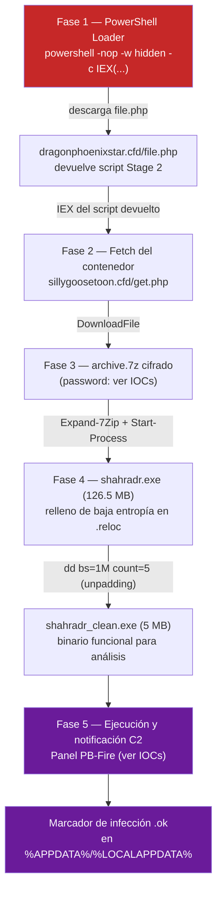

# Análisis de InfoStealer "shahradr" (PB-Fire C2)

> **Repositorio educativo / respuesta a incidente.** Documenta el análisis forense y de ingeniería inversa de un InfoStealer que comprometió una máquina personal. El objetivo es entender la cadena de infección completa y el mecanismo interno del malware con fines de aprendizaje y detección — **no contiene binarios, muestras ni scripts ejecutables del malware**, solo documentación, IOCs y diagramas.
>
> No se ejecutó nada de esto en un sistema en producción ni contra terceros: el análisis se hizo sobre una copia del binario ya extraído, en un entorno aislado (venv de Python + emulación con Unicorn/Speakeasy, sin acceso privilegiado del sistema).

## Resumen ejecutivo

| Campo | Valor |
|---|---|
| Nombre de muestra | `shahradr.exe` |
| Familia | InfoStealer (panel C2 en ruso, "PB-Fire") |
| Vector inicial | PowerShell loader multi-etapa (`IEX` + `WebClient`) |
| Empaquetador | Inflado con datos de baja entropía en `.reloc` (**no** son bytes `0x00`, ver [hallazgo 1](analysis/01-static-analysis.md)) |
| Cifrado del payload | AES-256-CBC real vía Windows CryptoAPI (**no** RC4, ver [análisis dinámico](analysis/02-unpacking.md)) |
| Evasión de control de flujo | Windows Thread Pool API (`CreateThreadpoolWork`) en vez de llamada directa |
| Estado del análisis | Payload desempaquetado hasta obtener el stub de mapeo manual de PE; **no se llegó a reconstruir el PE final ni a decompilar las funciones de robo** (SQLite3/DPAPI/navegadores) — ver [limitaciones](#limitaciones-y-trabajo-pendiente) |

## Cadena de infección (kill chain)

Desglose completo con las respuestas exactas del servidor en cada etapa: [`analysis/04-c2-communication.md`](analysis/04-c2-communication.md).

## Contenido del repositorio

- [`timeline.md`](timeline.md) — cronología de la investigación, turno por turno.
- [`analysis/01-static-analysis.md`](analysis/01-static-analysis.md) — análisis estático del binario (Cutter/rizin), estructura PE, direcciones clave.
- [`analysis/02-unpacking.md`](analysis/02-unpacking.md) — desempaquetado dinámico vía emulación (Speakeasy/Unicorn), cifrado real, extracción de clave/IV.
- [`analysis/03-payload-analysis.md`](analysis/03-payload-analysis.md) — análisis del payload desempaquetado (stub de mapeo manual de PE, strings encontrados).
- [`analysis/04-c2-communication.md`](analysis/04-c2-communication.md) — cadena de infección completa con respuestas del servidor.
- [`iocs.md`](iocs.md) — indicadores de compromiso (dominios, IP, hashes de clave, contraseñas, marcadores).
- [`data-exfiltrated.md`](data-exfiltrated.md) — qué tipo de datos está diseñado para robar este malware, y qué se confirmó vs. qué queda pendiente de confirmar.
- [`tools-used.md`](tools-used.md) — herramientas usadas durante la investigación y para qué sirvió cada una.
- [`appendix/commands-log.md`](appendix/commands-log.md) — comandos clave ejecutados durante el análisis (rutas genéricas, sin datos personales).

## Limitaciones y trabajo pendiente

Este análisis **corrigió varias hipótesis del reporte inicial** con evidencia real de emulación (ver detalle en cada documento), pero se detuvo antes de llegar a las funciones de robo de datos propiamente dichas:

1. El stub desempaquetado es un *mapeador manual de PE* posicionalmente independiente, no un PE clásico con cabecera `MZ`.
2. Le falta un puntero (offset `0xD`) hacia la imagen PE final, que normalmente se parcha justo antes de la ejecución real — no se localizó en esta sesión el punto exacto donde ocurre ese parche.
3. Por lo tanto, **no se decompilaron las funciones reales de robo de credenciales/cookies/SQLite3/DPAPI** — solo se confirmó su existencia por el tipo de panel C2 y el diseño típico de esta familia de InfoStealer (ver [`data-exfiltrated.md`](data-exfiltrated.md)).

Quien retome este análisis debería continuar desde `fcn.140012470` (dirección del parche del puntero) para completar la reconstrucción del PE final.
