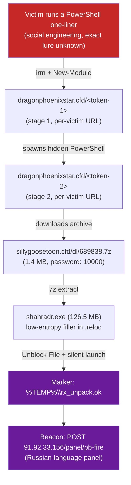

# InfoStealer "shahradr" Analysis (PB-Fire C2)

> **Educational / incident-response repository.** Documents the forensic and reverse-engineering analysis of an InfoStealer that compromised a personal machine. The goal is to understand the full infection chain and the malware's internals for learning and detection purposes.
>
> This is a **private** repository. It contains the real malicious PowerShell scripts (as inert text files, see [`stages/`](stages/)) and encrypted copies of the real malware binaries (see [`samples/`](samples/)) recovered during the investigation, alongside the write-up. Nothing here is directly executable as delivered — see the warnings in both folders before touching either.
>
> Nothing in this repo was run against a production system or a third party: analysis of the compiled binary was done on an isolated copy, in a sandboxed environment (a Python venv + Unicorn/Speakeasy emulation, no elevated system access). The PowerShell stage scripts were retrieved with `curl` and only ever read as text, never executed.

## Executive summary

| Field | Value |
|---|---|
| Sample name | `shahradr.exe` |
| Family | InfoStealer (Russian-language C2 panel, "PB-Fire") |
| Initial access | Victim socially engineered into manually running a PowerShell one-liner (exact lure not captured) — see [`analysis/01-initial-access.md`](analysis/01-initial-access.md) |
| Delivery mechanism | Two chained, per-victim single-use PowerShell stages, loaded as dynamic modules (not plain `IEX`), gated by a User-Agent check |
| Packer | Low-entropy filler in `.reloc` (**not** `0x00` bytes, see [finding 1](analysis/02-static-analysis.md#finding-1--the-reloc-padding-is-not-null-bytes)) — inflates the file from 1.4 MB (as delivered) to 126.5 MB |
| Payload encryption | Real AES-256-CBC via the Windows CryptoAPI (**not** RC4, see [finding 2](analysis/03-dynamic-unpacking.md#finding-2--the-real-cipher-is-aes-256-cbc-not-rc4)) |
| Control-flow evasion | Windows Thread Pool API (`CreateThreadpoolWork`) instead of a direct call |
| Status | Payload unpacked down to a manual PE-mapper stub; **the final PE reconstruction and the actual data-theft functions (SQLite3/DPAPI/browser paths) were never reached** — see [Status & known limitations](#status--known-limitations) |

## Verified infection chain

Full breakdown with the real, unmodified scripts: [`analysis/01-initial-access.md`](analysis/01-initial-access.md) and [`stages/`](stages/).

> The initial written incident report this investigation started from described a *different* (and, once verified, inaccurate) mechanism — different URLs, wrong archive password, wrong cipher. See [`analysis/05-c2-infrastructure.md#discrepancy-with-the-initial-report`](analysis/05-c2-infrastructure.md#discrepancy-with-the-initial-report) for the full comparison. This repo documents the **verified** version, confirmed by the affected user directly reproducing the download chain with `curl` on Linux.

## Repository contents

- [`TIMELINE.md`](TIMELINE.md) — turn-by-turn timeline of the investigation itself.
- [`analysis/01-initial-access.md`](analysis/01-initial-access.md) — the real, verified multi-stage PowerShell chain.
- [`analysis/02-static-analysis.md`](analysis/02-static-analysis.md) — static analysis of the binary (Cutter/rizin/objdump), PE structure, key addresses.
- [`analysis/03-dynamic-unpacking.md`](analysis/03-dynamic-unpacking.md) — dynamic unpacking via emulation (Speakeasy/Unicorn), the real cipher, key/IV extraction.
- [`analysis/04-payload-analysis.md`](analysis/04-payload-analysis.md) — analysis of the unpacked payload (manual PE-mapper stub, strings found).
- [`analysis/05-c2-infrastructure.md`](analysis/05-c2-infrastructure.md) — C2 beaconing and the discrepancy with the initial report.
- [`iocs.md`](iocs.md) — indicators of compromise (domains, IP, hashes, passwords, markers).
- [`data-exfiltrated.md`](data-exfiltrated.md) — what this malware family is designed to steal, and what was/wasn't confirmed.
- [`tools-used.md`](tools-used.md) — tools used during the investigation and what each was for.
- [`stages/`](stages/) — the real malicious PowerShell scripts, as inert text files, with warnings.
- [`samples/`](samples/) — encrypted copies of the real binary artifacts, with warnings and extraction instructions.
- [`appendix/commands-log.md`](appendix/commands-log.md) — key commands run during the investigation.
- [`appendix/unpack_shahradr.py`](appendix/unpack_shahradr.py) — the custom emulation/unpacking script written for this analysis.

## Status & known limitations

This analysis **corrected several hypotheses** from the initial report with real evidence from emulation and direct infrastructure verification (see each document above), but stopped short of the actual data-theft functions:

1. The unpacked stub is a *position-independent manual PE-mapper*, not a classic PE with an `MZ` header.
2. It's missing a pointer (at offset `0xD`) to the final PE image, which normally gets patched right before real execution — this session didn't locate exactly where that patch happens.
3. As a result, **the real credential/cookie/SQLite3/DPAPI theft functions were never decompiled** — their existence is inferred from the C2 panel type and the malware family's typical design (see [`data-exfiltrated.md`](data-exfiltrated.md)), not confirmed line-by-line.
4. A secondary, unverified lead surfaced late in the investigation (an incidental "MZ" match found by reversing the payload buffer's byte order) but was never checked before the investigating session was interrupted — see [`analysis/03-dynamic-unpacking.md#what-was-left-unresolved`](analysis/03-dynamic-unpacking.md#what-was-left-unresolved).

Anyone picking this back up should continue from `fcn.140012470` (the address where that pointer gets patched) to complete the final PE reconstruction.
