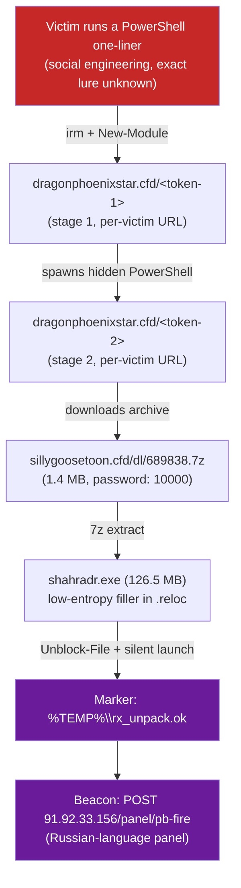

# InfoStealer "shahradr" Analysis (PB-Fire C2)


-2e7d32)


> **Educational / incident-response repository.** Documents the forensic and reverse-engineering analysis of an InfoStealer that compromised a personal machine. The goal is to understand the full infection chain and the malware's internals for learning and detection purposes.
>
> This is a **private** repository. It contains the real malicious PowerShell scripts (as inert text files, see [`stages/`](stages/)) and encrypted copies of the real malware binaries (see [`samples/`](samples/)) recovered during the investigation, alongside the write-up. Nothing here is directly executable as delivered — see the warnings in both folders before touching either.
>
> Nothing in this repo was run against a production system or a third party: analysis of the compiled binary was done on an isolated copy, in a sandboxed environment (a Python venv + Unicorn/Speakeasy emulation, no elevated system access). The PowerShell stage scripts were retrieved with `curl` and only ever read as text, never executed.

## Contents

- [At a glance](#at-a-glance)
- [Verified infection chain](#verified-infection-chain)
- [🔓 The final payload was recovered](#-the-final-payload-was-recovered)
- [🔎 A lead that was checked — and ruled out](#-a-lead-that-was-checked--and-ruled-out)
- [Repository contents](#repository-contents)
- [Status & known limitations](#status--known-limitations)

## At a glance

| Field | Value |
|---|---|
| Sample name | `shahradr.exe` |
| Family | InfoStealer (Russian-language C2 panel, "PB-Fire") |
| Initial access | Victim socially engineered into manually running a PowerShell one-liner (exact lure not captured) — see [`analysis/01-initial-access.md`](analysis/01-initial-access.md) |
| Delivery mechanism | Two chained, per-victim single-use PowerShell stages, loaded as dynamic modules (not plain `IEX`), gated by a User-Agent check |
| Real archive password | **`10000`** — recovered by `grep`-ing the actual dropper script, not guessed (see [below](#verified-infection-chain)) |
| Packer | Low-entropy filler in `.reloc` (**not** `0x00` bytes, see [finding 1](analysis/02-static-analysis.md#finding-1--the-reloc-padding-is-not-null-bytes)) — inflates the file from 1.4 MB (as delivered) to 126.5 MB |
| Payload encryption | Real AES-256-CBC via the Windows CryptoAPI (**not** RC4, see [finding 2](analysis/03-dynamic-unpacking.md#finding-2--the-real-cipher-is-aes-256-cbc-not-rc4)) |
| Control-flow evasion | Windows Thread Pool API (`CreateThreadpoolWork`) instead of a direct call |
| Final payload | **Recovered.** A second, self-contained AES-256-CBC-encrypted blob inside the unpacked buffer decrypts to a valid PE — see [below](#-the-final-payload-was-recovered) |
| Confirmed capability | **Chrome App-Bound Encryption bypass** (targets up-to-date Chrome, not just legacy DPAPI), plus AMSI bypass, NTDLL unhooking, process masquerading, and registry persistence — see [`data-exfiltrated.md`](data-exfiltrated.md) |
| Status | Final payload recovered and its capabilities confirmed via strings; a byte-level trace of the App-Bound bypass and live network exfiltration were not captured — see [Status & known limitations](#status--known-limitations) |

## Verified infection chain



Full breakdown with the real, unmodified scripts: [`analysis/01-initial-access.md`](analysis/01-initial-access.md) and [`stages/`](stages/).

> The initial written incident report this investigation started from described a *different* (and, once verified, inaccurate) mechanism — different URLs, wrong archive password, wrong cipher. See [`analysis/06-c2-infrastructure.md#discrepancy-with-the-initial-report`](analysis/06-c2-infrastructure.md#discrepancy-with-the-initial-report) for the full comparison. This repo documents the **verified** version, confirmed by the affected user directly reproducing the download chain with `curl` on Linux.

**Nothing above was guessed.** Every arrow in that diagram is backed by a request that was actually made and a response that was actually read — including the password. The real dropper script (`stage2_dropper.ps1`) was fetched as plain text and searched directly:

```bash
$ grep -iE '(\$pw|password)' stage2.txt
$pw = '10000'
& $bin x $arc "-p$pw" "-o$out" -y | Out-Null
```

That's how `10000` was confirmed as the real extraction password — replacing the `ShahradR_Pass2026` guess from the original report. Full command sequence: [`appendix/commands-log.md`](appendix/commands-log.md).

## 🔓 The final payload was recovered

The unpacked buffer turned out to contain **a second, self-contained encrypted blob with its own AES-256 key and IV sitting right next to it** — no external patch or live network fetch needed. One of the mapper's own sub-functions decrypts it, strips PKCS7 padding, and reverses the result byte-for-byte. Reproducing that in ~10 lines of Python produces a fully valid PE:

```
$ file final_stealer_candidate.exe
final_stealer_candidate.exe: PE32+ executable for MS Windows 6.00 (GUI), x86-64, 5 sections
```

Its strings confirm real, current-generation capabilities — most notably a **Chrome App-Bound Encryption bypass** (the literal string `appbound` plus the COM interop needed to call it), the mechanism Chrome introduced in 2024 specifically to stop older DPAPI-based stealers. Also present: an AMSI bypass, `ntdll.dll` unhooking, process-masquerading references (`splwow64.exe`, `RuntimeBroker.exe`, `explorer.exe`), `Run`/`RunOnce` registry persistence, and an `msiexec`-based execution path.

Full extraction recipe, exact offsets, and the complete capability breakdown: [`analysis/05-final-payload-capabilities.md`](analysis/05-final-payload-capabilities.md). What this means for data at risk: [`data-exfiltrated.md`](data-exfiltrated.md).

## 🔎 A lead that was checked — and ruled out

While decompiling `fcn.140012230` (the function that allocates the second payload buffer, see [`analysis/03-dynamic-unpacking.md`](analysis/03-dynamic-unpacking.md)), the binary itself turned out to contain a **conditional in-place byte-reversal loop** — code that flips a buffer end-to-end when a certain flag bit is set. That raised an obvious question: does the *whole* 573,600-byte unpacked payload need to be reversed to reveal a real PE image?

```bash
python3 -c "
data = open('payload_unpacked.exe','rb').read()
rev = data[::-1]
idx = rev.find(b'MZ')
print('MZ found at offset:', idx)
"
# MZ found at offset: 23224
```

Reversing the buffer does produce an `MZ` (PE signature) match, at offset 23224. But checking the field right after it (`e_lfanew`, which should point to the real PE header) shows it resolves to a location **far outside the buffer** — meaning this is just another byte coincidence, the same as an earlier, unrelated `MZ` match found at a similar offset (~23212) in the non-reversed buffer. Full commands and the exact output: [`appendix/commands-log.md`](appendix/commands-log.md) and [`analysis/03-dynamic-unpacking.md#byte-reversal-lead--checked-ruled-out`](analysis/03-dynamic-unpacking.md#byte-reversal-lead--checked-ruled-out).

So the real next step is still open: [`analysis/04-payload-analysis.md`](analysis/04-payload-analysis.md#whats-needed-to-reach-the-actual-stealer-functions) explains exactly what's missing — a pointer that `fcn.140012470` patches right before the final PE gets mapped, which was never located in this session.

## Repository contents

**Write-up**
- [`TIMELINE.md`](TIMELINE.md) — day-by-day timeline of the investigation itself.
- [`iocs.md`](iocs.md) — indicators of compromise (domains, IP, hashes, passwords, markers).
- [`data-exfiltrated.md`](data-exfiltrated.md) — what this malware family is designed to steal, and what was/wasn't confirmed.
- [`tools-used.md`](tools-used.md) — tools used during the investigation and what each was for.

**Technical analysis**
- [`analysis/01-initial-access.md`](analysis/01-initial-access.md) — the real, verified multi-stage PowerShell chain.
- [`analysis/02-static-analysis.md`](analysis/02-static-analysis.md) — static analysis of the binary (Cutter/rizin/objdump), PE structure, key addresses.
- [`analysis/03-dynamic-unpacking.md`](analysis/03-dynamic-unpacking.md) — dynamic unpacking via emulation (Speakeasy/Unicorn), the real cipher, key/IV extraction.
- [`analysis/04-payload-analysis.md`](analysis/04-payload-analysis.md) — analysis of the unpacked payload (manual PE-mapper stub, strings found).
- [`analysis/05-final-payload-capabilities.md`](analysis/05-final-payload-capabilities.md) — recovering and decrypting the real final payload, and what it's actually capable of.
- [`analysis/06-c2-infrastructure.md`](analysis/06-c2-infrastructure.md) — C2 beaconing and the discrepancy with the initial report.

**Evidence**
- [`stages/`](stages/) — the real malicious PowerShell scripts, as inert text files, with warnings.
- [`samples/`](samples/) — encrypted copies of the real binary artifacts, with warnings and extraction instructions.
- [`appendix/commands-log.md`](appendix/commands-log.md) — key commands run during the investigation.
- [`appendix/unpack_shahradr.py`](appendix/unpack_shahradr.py) — the custom emulation/unpacking script written for this analysis.

## Status & known limitations

This analysis **corrected several hypotheses** from the initial report with real evidence from emulation and direct infrastructure verification, and went on to recover and validate the actual final payload (see each document above). What's confirmed vs. still open:

1. ✅ The unpacked stub is a *position-independent manual PE-mapper*; the pointer it needed (offset `0xD`) turned out to be computed internally, not externally patched — see [`analysis/05-final-payload-capabilities.md`](analysis/05-final-payload-capabilities.md).
2. ✅ The final payload was decrypted and validated as a real PE, and its capabilities (App-Bound Encryption bypass, AMSI bypass, NTDLL unhooking, persistence) are confirmed via strings and dynamically-loaded DLLs.
3. ✅ The [byte-reversal lead](#-a-lead-that-was-checked--and-ruled-out) from earlier was checked and ruled out — it wasn't the missing piece; the real one was found separately.
4. ⬜ **Not done:** a byte-for-byte trace of the App-Bound Encryption bypass routine, and real network exfiltration traffic — capturing that would need detonating the binary in a monitored, network-isolated VM with a residential-looking egress IP (the malware's own ASN gate refuses to run otherwise, see [`analysis/05-final-payload-capabilities.md`](analysis/05-final-payload-capabilities.md#the-gate-check-explained)).
5. ⬜ **Not done:** the exact registry key/value name used for persistence, and the precise process-masquerading technique (injection vs. hollowing vs. something else).

Anyone picking this back up should start from item 4 — a controlled, monitored detonation is the natural next step now that the static analysis has gone as far as it reasonably can.
