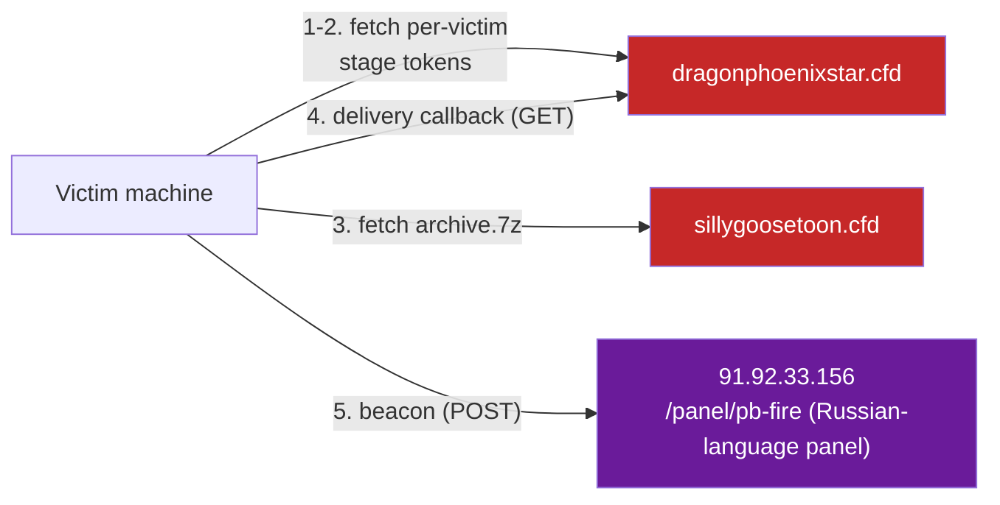

# 05 — C2 infrastructure and beaconing

## Confirmed network calls (from the real `stage2_dropper.ps1`, see [`../stages/`](../stages/))

| Step | Request | Purpose |
|---|---|---|
| Archive download | `GET https://sillygoosetoon.cfd/dl/689838.7z` (HTTP fallback) | Fetches the password-protected `.7z` containing `shahradr.exe`. |
| Portable 7-Zip (fallback only) | `GET http://91.92.33.156/t/7z.exe`, `https://dragonphoenixstar.cfd/t/7z.exe`, `http://dragonphoenixstar.cfd/t/7z.exe` | Only used if the victim doesn't already have 7-Zip installed. |
| Delivery callback | `GET http://dragonphoenixstar.cfd/dl-callback/2agdrse7-zjhtj5yt-e8bzg5pg-ana9vc6n/689838.7z/c8dabf19d44b35e4f2223b2e55acc71b` | Fired right after launching the payload. The path encodes what looks like a session/task ID (`2agdrse7-zjhtj5yt-e8bzg5pg-ana9vc6n`), the archive name (`689838.7z`), and a hash-like token — almost certainly telemetry confirming "payload delivered and launched" to the operator's tracking system. |
| C2 beacon | `POST http://91.92.33.156/panel/pb-fire` (empty body in this script) | The Russian-language control panel endpoint. In this dropper script the POST body is empty — a simple "installation complete" ping. The actual data theft/exfiltration (browser credentials, cookies, etc.) is expected to happen from *inside* the running `shahradr.exe` process, not from this PowerShell script — see [`../data-exfiltrated.md`](../data-exfiltrated.md) for what was and wasn't confirmed about that. |

Every request from the dropper script uses the header `X-Panel-Internal: 1` in addition to a spoofed `WindowsPowerShell/5.1` User-Agent — both of which the server appears to require (see [`01-initial-access.md`](01-initial-access.md) for the User-Agent-gating behavior observed directly).

## Discrepancy with the initial report

The investigation started from a written incident report describing a **different** mechanism. Once verified directly against the live infrastructure (see [`01-initial-access.md`](01-initial-access.md)), several details in that initial report turned out to be inaccurate:

| Claim in the initial report | What was actually verified |
|---|---|
| Loader fetches `dragonphoenixstar.cfd/file.php`, which returns a script that fetches `sillygoosetoon.cfd/get.php` | Real chain uses two **per-victim token URLs** on `dragonphoenixstar.cfd` (`/​<token1>` → `/<token2>`), loaded as PowerShell modules via `irm` + `New-Module`, not static file names via `IEX` |
| `.7z` archive password: `ShahradR_Pass2026` | Real password (found directly in the dropper script): **`10000`** |
| Cipher inside the binary: RC4 with key rotation | Real cipher: **AES-256-CBC** via the real Windows CryptoAPI (see [`03-dynamic-unpacking.md`](03-dynamic-unpacking.md)) |
| `.reloc` padding is `0x00` bytes | Real padding is a repeating low-entropy 16-byte pattern (see [`02-static-analysis.md`](02-static-analysis.md)) |
| Control transfer via a direct `call rax` | Real transfer goes through `CreateThreadpoolWork` / `SubmitThreadpoolWork` (see [`03-dynamic-unpacking.md`](03-dynamic-unpacking.md)) |
| Infection marker: unspecified `.ok` file | Real, confirmed filename: **`rx_unpack.ok`** in `%TEMP%` |

None of this means the initial report was written in bad faith — it's consistent with a **generic/templated write-up of "how this malware family typically behaves"** rather than a first-hand capture of this specific incident's traffic. The lesson for anyone reusing this repo as a reference: **verify IOCs and mechanisms directly against a live sample or live infrastructure whenever possible**, rather than trusting a secondhand report at face value — which is exactly what this investigation did by reproducing the download chain with `curl` on Linux.

## Infrastructure diagram

All concrete indicators are consolidated in [`../iocs.md`](../iocs.md).
